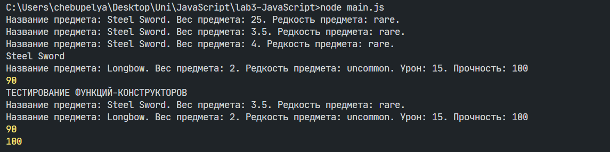

# Лабораторная работа №3: Продвинутые объекты в JavaScript

## Инструкция по запуску проекта
1. Клонируйте репозиторий:
   ```bash
   git clone https://github.com/statova-nadejda/lab3-JavaScript.git
   cd lab3-JavaScript
   ```
2. Запустите проект в `VS Code` при помощи среды выполнения кода `Node.js`

## Цель работы

Познакомиться с классами и объектами в JavaScript, научиться создавать классы, использовать конструкторы и методы, а также реализовать наследование.

## Условие

Создано консольное приложение, моделирующее систему инвентаря, где можно добавлять предметы, изменять их свойства и управлять ими.

## Структура проекта

Проект состоит из трех файлов:

1. `classes` - папка для классов.
   - `Item.js` - реализация класса Item
   - `Weapon.js` - реализация класса Weapon
2. `functionConstructors` - папка для функций-конструкторов.
   - `ItemFunction` - реализация функции-конструктора ItemFunction
   - `WeaponFunction` - реализация функции-конструктора WeaponFunction
3. `main.js` - тестирование обеих реализаций.

## Шаг 1: Создание класса Item

### Поля класса:

- `name` – название предмета.
- `weight` – вес предмета. 
- `rarity` – редкость предмета (common, uncommon, rare, legendary). Для того, чтобы `rarity` могло принимать только 4 разных параметра, создаем отдельную переменную, где пропишем варианты и в конструкторе будем проверять ввод пользователья на соответствие с вариантами.

```JavaScript
if (!Object.values(rarityPossibleVal).includes(rarity)) {
            throw new Error("Ошибка! Выберите допустимое значение для rarity (common, uncommon, rare, legendary)");
        }
        this.rarity = rarity;
```
### Конструктор: 

Принимает параметры `name`, `weight`, `rarity` и присваивает значения соответствующим переменным. В случае ввода отрицательного числа в поле `weight` и не предусмотренное `rarity`, будет выводится соответствующая ошибка.

```JavaScript 
constructor(name, weight, rarity) {
        this.itemName = name;
    
        if (weight <= 0) {
            throw new Error("Ошибка! Вес должен быть положительным числом");
        }
        this.weight = weight;
        ...
```

### Методы:

- `getInfo()` – возвращает строку с информацией о предмете.
- `setWeight(newWeight)` – Идет проверка на допустимое значение в поле `newWeight` и в случае успешной проверики изменяет вес предмета.


### Пример использования:

```javascript
const sword = new Item("Steel Sword", 3.5, "rare");
console.log(sword.getInfo());
sword.setWeight(4.0);
```

## Шаг 2: Создание класса Weapon

При помощи ключевого слова `extends` делаем этот класс наслдником `Item`

### Добавляем дополнительные поля:

- `damage` – урон оружия.
- `durability` – прочность (от 0 до 100).

### Консруктор: 

Конструктор использует `super(name, weight, rarity)`, что указывает на то, что этот класс является дочерним по отношению к `Item` и переопределяет его конструктор. Он наследует свойства `name`, `weight` и `rarity` от своего родительского класса.

```JavaScript
constructor(name, weight, rarity, damage, durability){
        super(name, weight, rarity);
        if(damage < 0){
            throw new Error("Ошибка! Урон не может быть отрицательным числом");
        }
        this.damage = damage;
        if (durability <= 0 && durability > 100){
            throw new Error("Ошибка! Прочность вашего оружия должна быть в диапозоне 0-100")
        }
        this.durability = durability;
    }
```

Если значение `damage` меньше 0, выбрасывается ошибка, так как урон не может быть отрицательным.

Если значение `durability` меньше или равно 0 или больше 100, выбрасывается ошибка, так как прочность должна быть в диапазоне от 0 до 100.

Если проверки пройдены, свойствам присваиваются соответствующие значения.

### Методы:

- `getInfo()` - переопределяем метод, посколько будет выводится еще и информация об уроне и прочности
- `use()` – уменьшает durability на 10 (если durability > 0, в противном случае выводит сообщение о том, что оружие сломано).
- `repair()` – восстанавливает durability до 100.

### Пример использования:

```javascript
const bow = new Weapon("Longbow", 2.0, "uncommon", 15, 100);
console.log(bow.getInfo());
bow.use();
console.log(bow.durability); //уменьшается
bow.repair();
```

## Шаг 3: Тестирование

В файле `main.js` создаются несколько объектов классов `Item` и `Weapon`, затем вызываются их методы, чтобы убедиться в правильности работы.

### Тестирование классов:

```javascript
const sword = new Item ("Steel Sword", 3.5, "rare");
console.log(sword.getInfo());
sword.setWeight(4.0); //Изменим вес оружия
console.log(sword.getInfo()); //Выведется информация с новым весом

const bow = new Weapon("Longbow", 2.0, "uncommon", 15, 100);
console.log(bow.getInfo());
bow.use(); //Уменьшаем свойство прочности на 10
console.log(bow.durability);//Выведется обновленная прочность (90)
bow.repair(); //Восттановим прочность до 100
```

### Тестирование функций-конструкторов:
В файле `main.js` тестируем все функции-конструкторы, создавая объекты и изменяя и их свойства

```javascript
const sword1 = new Item("Steel Sword", 3.5, "rare");
console.log(sword1.getInfo());
const bow1 = new Weapon("Longbow", 2.0, "uncommon", 15, 100);
console.log(bow1.getInfo());
bow1.use();
console.log(bow1.durability);
bow1.repair();
console.log(bow1.durability);
```
;
ж

## Шаг 4: Дополнительное задание

### Опциональная цепочка (?.)
- Опциональная цепочка ?. — это безопасный способ доступа к свойствам вложенных объектов, даже если какое-либо из промежуточных свойств не существует.

Использована при доступе к свойствам объекта для предотвращения ошибок. Опциональная цепочка останавливает вычисление и возвращает `undefined`, если значение перед `?.` равно `undefined` или `null`.

```javascript
console.log(sword?.itemName);
console.log(bow?.durability);
```

### Создание функции-конструктора

Классы `Item` и `Weapon` были переписаны с использованием функций-конструкторов и прототипного наследования. В функциях-конструкторах прописываем те же свойства и методы, что в классах.

- Вместо использования ключевого слова  `class`, объекты создаются с помощью функций-конструкторов (Item и Weapon).

- Свойства объекта задаются через `this` внутри функции-конструктора.

### 2. **Наследование**
   - Наследование реализуется вручную через:
     - `Object.create(Item.prototype)` для настройки прототипа.
     - `Item.call(this, ...)` для вызова родительского конструктора.
 
### 3. **Добавление методов**
   - Методы добавляются вручную через прототип:
     ```javascript
     Item.prototype.getInfo = function() { ... };
     ```
### 4. **Проверки данных**
   - В этом подходе проверки на корректность данных (например, вес, урон, прочность) выполняются непосредственно внутри функции-конструктора.

## Документирование кода

Код задокументирован в соответствии со стандартом **JSDoc**. Все методы снабжены комментариями с описанием параметров, возвращаемых значений и функциональности.

## Контрольные вопросы

1. **Какое значение имеет ``**this**`` в методах класса?**

   - `this` внутри метода класса указывает на текущий экземпляр объекта, который вызывает метод.

2. **Как работает модификатор доступа `**#**` в JavaScript?**

   - `#` делает поле или метод **приватными**, ограничивая доступ к ним только внутри класса.

3. **В чем разница между классами и функциями-конструкторами?**

   - Классы предоставляют **синтаксический сахар** над функциями-конструкторами, делая код более читаемым.
   - В функциях-конструкторах методы добавляются через `prototype`, тогда как в классах они автоматически включаются в `prototype`.
   - В классах можно использовать `super` для вызова родительского конструктора, а в функциях-конструкторах нужно использовать `call` или `apply`.

---

### Вывод:

В ходе выполнения лабораторной работы были изучены и реализованы:

- Классы и объекты в JavaScript.
- Наследование классов.
- Методы работы с объектами.
- Функции-конструкторы.

### Библиография 

- https://learn.javascript.ru/class 
- https://learn.javascript.ru/class-inheritance 
- https://learn.javascript.ru/prototypes 
- https://learn.javascript.ru/constructor-new
- https://github.com/MSU-Courses/javascript/blob/main/docs/09_advanced_objects/91_this_keyword.md
- https://github.com/MSU-Courses/javascript/blob/main/docs/09_advanced_objects/93_constructor_new.md
- https://github.com/MSU-Courses/javascript/blob/main/docs/09_advanced_objects/95_classes.md


